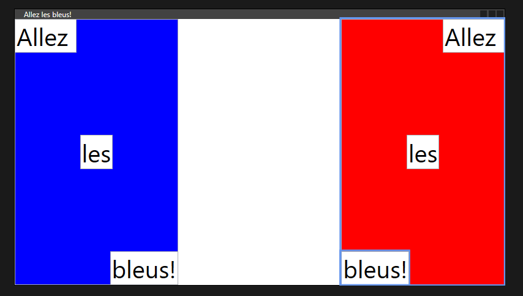
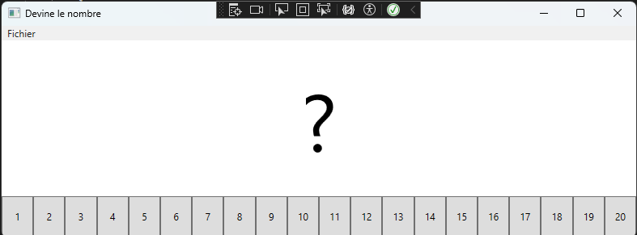
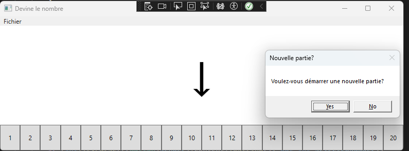

# WPF

Toutes les informations utiles sont sur teams dans le cahier de note de classe.

## IntroWPF

- C'est quoi WPF?
- C'est quoi XAML?
- Comment on fait pour y ajouter un élément avec la souris?
- Comment on fait pour ajouter un élément avec le code xml?
- Comment on modifie un élément avec le code C#?
- Comment on nomme nos éléments et nos actions?

### Exercice 1. Créer un bouton toggle.

#### But de l'exercice

Apprendre les bases de WPF.

#### Ce que tu dois faire

Ajouter un bouton dans l'interface et un text box.
Quand on clic sur le bouton, le bouton change d'état et le text box aussi.
Voici les deux états conjoints du bouton et du text box.
- **état 1** Bouton : "STOP", TextBox : "En marche"
- **état 1** Bouton : "Démarrer", TextBox : "Arrêté"

### Exercice 2. Grid.

#### But de l'exercice

Comprendre le fonctionnement de Grid.
C'est à dire :
- Comment un on construit notre grid?
- Comment on alligne un élément dans une grid?
- Comment on ajoute une grid dans une grid?
- Comment on met les élément dans une endroit précis de la grid?

#### Ce que tu dois faire

Crée le drapeau de la France! Et dans le drapeau de la France, tu dois ajouter Allez les bleus!

Voici un exemple : 


Pour t'aider, tu dois utiliser
- `Grid.row`
- `Grid.Column`
- `HorizontalAlignment`
- `VerticalAlignment`
- Les grids dans les grids.
- T'assurer que l'ordre des éléments ne soit pas problématique!

### Exercice 3. Ajouter un nom.

#### But de l'exercice

Être en mesure d'ajouter des éléments dans une interface WPF avec le code.
Comprendre les arguments `sender` et `e`.

#### Ce que tu dois faire

À partir du code fourni, tu dois ajouter le nom dans la Grid du dessous.

Voici un petit bout de code qui montre comment créer un TextBlock.

```C#
var tbNom = new TextBlock();
tbNom.Margin = new Thickness(0, 0, 0, 0);
gridNoms.Children.Add(tbNom);
```

Tu dois ajouter un maximum de 10 noms et ils ne doivent pas s'empiler les uns sur les autres.

BONUS

- L'ajout de nom fonctionne aussi avec la touche retour de ton clavier.
- Le champ texte est vidé lorsqu'un nom est ajouté.

### Exercice 4. Devine le chiffre.

#### But de l'exercice

Assimiler tous les concepts vus jusqu'à présent et Créer une interface pour jouer à devine le chiffre avec une interface.

Je t'invite aussi à aller voir le menu! Assures-toi de comprendre comment il fonctionne.

#### Ce que tu dois faire

Créer une interface qui permet de jouter à devnine le chiffre avec des boutons de 1 à 20.

Tu dois ajouter les boutons à ton interface avec le code.

Pour ajouter un évènement click sur un bouton, tu peux utiliser ce bout de code. 

`button.Click += OnBtnNumberClick;`

`OnBtnNumberClick` est une fonction qui ressemble à ceci : 

```C# 
void OnBtnNumberClick(object sender, RoutedEventArgs e) 
{
  // pour accéder au label dans le bouton
  string labelDuBouton = (Button)sender).Content.ToString();
}
```
Voici les flèches si tu veux les utiliser : `↓` `↑`

Voici quelques captures d'écran pour t'aider.



BONUS : 
- Au lieu d'utiliser margin, ajoute les boutons à un élément grid.
- Disable le bouton quan tu clics dessus. Attention! Tu dois les remettre en fonction quand la partie redémarre!
- Faire fonctionner le menu.